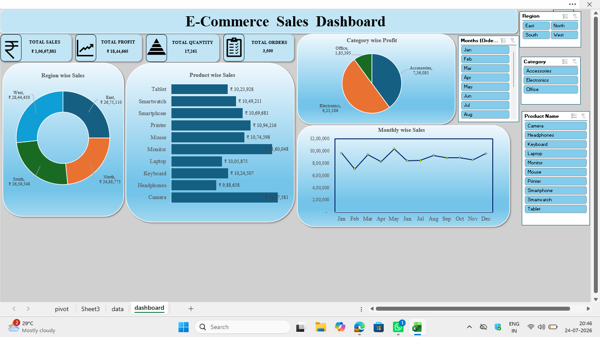

# E-Commerce Sales Dashboard

An interactive E-Commerce Sales Dashboard created using Microsoft Excel to analyze sales performance and generate meaningful business insights.

## Tools Used
- Microsoft Excel
- Pivot Tables
- Pivot Charts
- Slicers
- KPI Cards

## Project Overview
This project analyzes E-Commerce sales data and presents key business metrics through an interactive Excel dashboard.

## Key Features
- Total Sales KPI
- Total Orders KPI
- Total Profit KPI
- Regional Sales Analysis
- Product Performance Analysis
- Monthly Sales Trend
- Interactive Slicers for filtering data

## Dashboard
The Excel dashboard provides an interactive view of sales performance and helps users identify trends and compare business performance across different categories.

## Project File
- `Excel Dashboard P1.xlsx` – Complete Excel dashboard project.
- 
## Dashboard Preview

## Author
Manoj Mari
